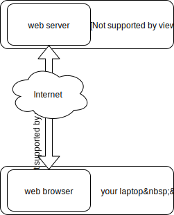
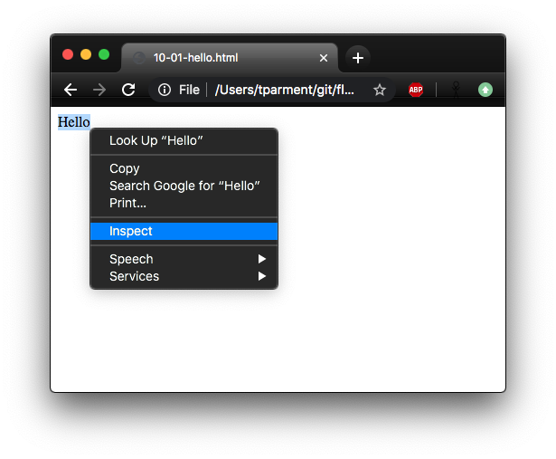
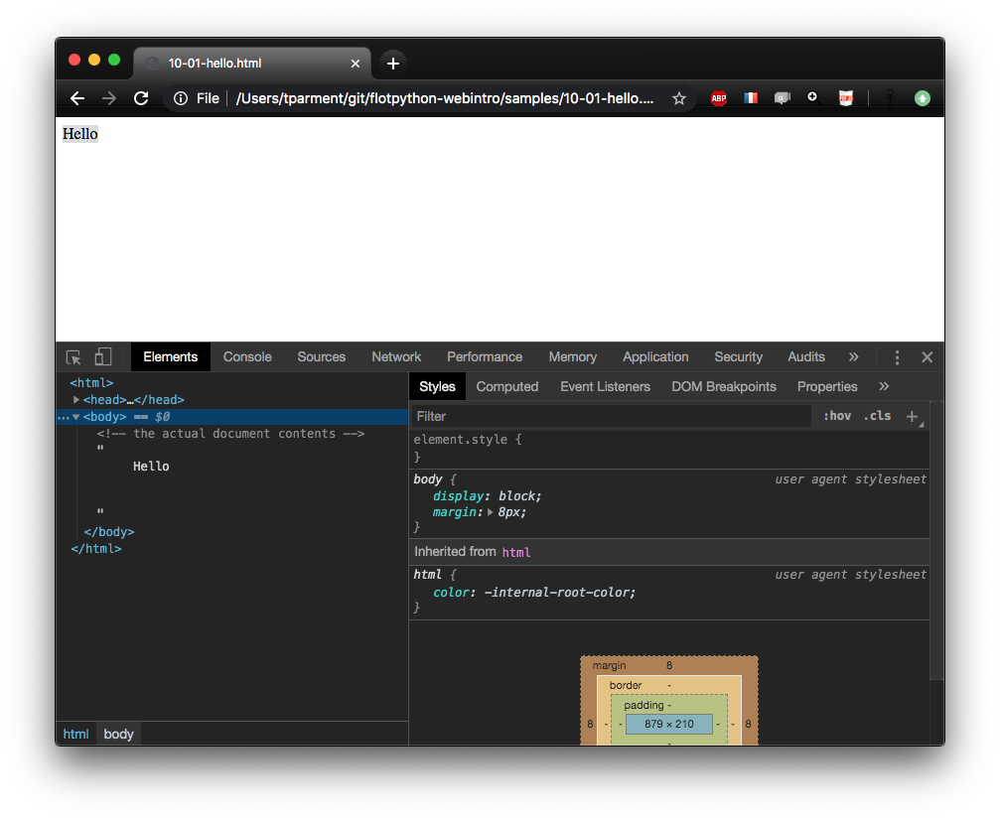
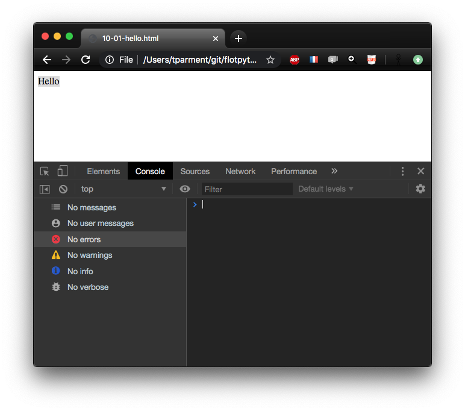

---
jupyter:
  celltoolbar: Slideshow
  jupytext:
    cell_metadata_filter: all
    formats: md
    notebook_metadata_filter: all,-language_info
    text_representation:
      extension: .md
      format_name: markdown
      format_version: '1.2'
      jupytext_version: 1.3.2
  kernelspec:
    display_name: Javascript (Node.js)
    language: javascript
    name: javascript
  notebookname: html basics
  rise:
    autolaunch: true
    slideNumber: c/t
    start_slideshow_at: selected
    theme: sky
    transition: cube
  version: '1.0'
---

<div class="licence">
<span>Licence CC BY-NC-ND</span>
<span>Thierry Parmentelat</span>
</div>

```javascript slideshow={"slide_type": "-"}
tools = require('../js/tools');
tools.use_style('../media/in-out.css');
```

<!-- #region slideshow={"slide_type": "slide"} -->
# html basics
<!-- #endregion -->

the overall structure of a HTML document looks like this :

```javascript hide_input=true
fragment1 = `<html>
  <head>
     <!-- various document-wide declarations -->
  </head>
  <body>
     <!-- the actual document contents -->
     Hello
  </body>
</html>
`;

tools.one_column(fragment1)

```

<!-- #region slideshow={"slide_type": "slide"} -->
# browser and server
<!-- #endregion -->

<!-- #region slideshow={"slide_type": ""} cell_style="split" -->
### regular setup


<!-- #endregion -->

<!-- #region slideshow={"slide_type": ""} cell_style="split" -->
### our setup today


<!-- #endregion -->

<!-- #region slideshow={"slide_type": "slide"} -->
## practice

* create a file named in `.html`
* copy the above template
* open it in your web browser
* you will see something like this
<!-- #endregion -->

```javascript hide_input=true slideshow={"slide_type": "slide"}
tools.two_columns(fragment1)

```

<!-- #region slideshow={"slide_type": "slide"} -->
# devel tools
<!-- #endregion -->

using a right click on the 'Hello' text

<!-- #region slideshow={"slide_type": ""} -->

<!-- #endregion -->

<!-- #region slideshow={"slide_type": "slide"} -->
you can reach your browser's devel tools  
(may need additional prep / install)  
use Chrome in case it is not working as expected  
 
<!-- #endregion -->

<!-- #region slideshow={"slide_type": "slide"} -->
another interesting part is the (javascript) Console  
where you can interact with the browser (more on this later)
<!-- #endregion -->

<!-- #region slideshow={"slide_type": ""} -->
 
<!-- #endregion -->

<!-- #region slideshow={"slide_type": "slide"} -->
# Abstract Syntax Tree

* the `<tag> ... </tag>` notation 
* unambiguously maps to a tree structure - known as an Abstract Syntax Tree
<!-- #endregion -->

```javascript cell_style="center" hide_input=true slideshow={"slide_type": "slide"}
tree_html = `<html>
  <head>
    <title> top title </title>
  </head>
  <body>
    <p> a paragraph </p>
    <p> a paragraph </p>
  </body>
</html>`;
tools.one_column(tree_html)
```

<!-- #region cell_style="center" hide_input=true -->

<!-- #endregion -->

<!-- #region slideshow={"slide_type": "slide"} -->
# be rigourous

* browsers tend to be as tolerant as possible
* e.g. omitting a closing tag may well render fine
* **however** there's only so much that can be guessed
* so make sure to **always** close your tags properly
<!-- #endregion -->

```javascript hide_input=true slideshow={"slide_type": "slide"}
fragment_unclosed = `<p> do not
<p> do this`;

tools.two_columns(fragment_unclosed)
 
```

```javascript hide_input=true
fragment_closed = `<p> do this instead </p>
<p> clean up behind yourself </p>`;

tools.two_columns(fragment_closed)
 
```
