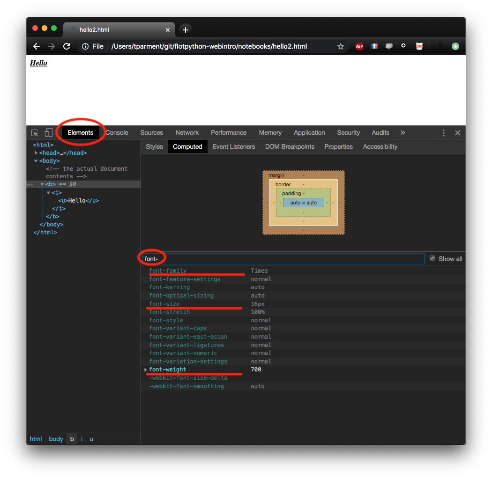

---
jupyter:
  celltoolbar: Slideshow
  jupytext:
    cell_metadata_filter: all
    formats: md
    notebook_metadata_filter: all,-language_info
    text_representation:
      extension: .md
      format_name: markdown
      format_version: '1.2'
      jupytext_version: 1.3.2
  kernelspec:
    display_name: Javascript (Node.js)
    language: javascript
    name: javascript
  notebookname: css basics
  rise:
    autolaunch: true
    slideNumber: c/t
    start_slideshow_at: selected
    theme: sky
    transition: cube
  toc:
    base_numbering: 1
    nav_menu: {}
    number_sections: true
    sideBar: false
    skip_h1_title: false
    title_cell: Table of Contents
    title_sidebar: Contents
    toc_cell: false
    toc_position:
      height: 207px
      left: 30px
      top: 170px
      width: 306.797px
    toc_section_display: true
    toc_window_display: true
  version: '1.0'
---

<div class="licence">
<span>Licence CC BY-NC-ND</span>
<span>Thierry Parmentelat</span>
</div>

<!-- #region slideshow={"slide_type": ""} -->
# CSS basics
<!-- #endregion -->

```javascript
// run these 2 cells, and then 
// click the created button
tools = require('../js/tools');
tools.use_style('../media/in-out.css');
```

```javascript
tools.run_all_button();
```

<!-- #region slideshow={"slide_type": "slide"} -->
## purpose of style sheet
<!-- #endregion -->

<!-- #region slideshow={"slide_type": ""} -->
* keep contents and presentation separate
* allow to adapt same contents 
  * to different media
  * to differents tastes (themes)
* generally written by people with different background and sensibility
  * engineers *vs* designers
<!-- #endregion -->

<!-- #region slideshow={"slide_type": "slide"} -->
## what can be styled ?
<!-- #endregion -->

<!-- #region slideshow={"slide_type": ""} -->
* short answer : virtually everything
* let's start with the obvious
<!-- #endregion -->

<!-- #region slideshow={"slide_type": "slide"} -->
## text properties
<!-- #endregion -->

<!-- #region slideshow={"slide_type": ""} -->
* `font-family` : e.g. Times
* `font-size` : e.g. 12px
* `font-weight` : e.g. bold
* `font-style` : e.g. italic
* `text-decoration` : e.g. underline
* … and a whole many more
<!-- #endregion -->

<!-- #region cell_style="center" slideshow={"slide_type": "slide"} -->

<!-- #endregion -->

<!-- #region cell_style="center" slideshow={"slide_type": "slide"} trusted=true -->

<!-- #endregion -->

<!-- #region slideshow={"slide_type": "slide"} -->
## first example
<!-- #endregion -->

* we create a hyperlink to google
* we use `target='_'` to tell the browser to open the link in another tab/window
* we attach a CSS fragment to change its appearance
* **warning** this changes **all the `<a>` elements** on that page

```javascript hide_input=true slideshow={"slide_type": "slide"}
link_html = `<a href="https://www.google.com" target="_">
link to google
</a>
`;
link_css = `a {
    color: red;
    font-family: times;
    font-size: large;
    border: 1px solid green;
}`;
tools.html_css(link_html, link_css);
```
