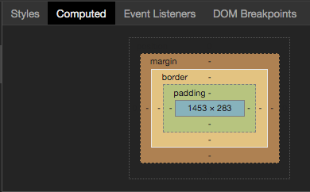

---
jupyter:
  celltoolbar: Slideshow
  jupytext:
    cell_metadata_filter: all
    formats: md
    notebook_metadata_filter: all,-language_info
    text_representation:
      extension: .md
      format_name: markdown
      format_version: '1.2'
      jupytext_version: 1.3.2
  kernelspec:
    display_name: Javascript (Node.js)
    language: javascript
    name: javascript
  notebookname: CSS properties
  rise:
    autolaunch: true
    slideNumber: c/t
    start_slideshow_at: selected
    theme: sky
    transition: cube
  toc:
    base_numbering: 1
    nav_menu: {}
    number_sections: true
    sideBar: false
    skip_h1_title: false
    title_cell: Table of Contents
    title_sidebar: Contents
    toc_cell: false
    toc_position:
      height: 47px
      left: 31px
      top: 87px
      width: 159.359px
    toc_section_display: false
    toc_window_display: true
  version: '1.0'
---

<div class="licence">
<span>Licence CC BY-NC-ND</span>
<span>Thierry Parmentelat</span>
</div>

<!-- #region slideshow={"slide_type": ""} -->
# CSS main properties
<!-- #endregion -->

```javascript
// run this cell, and then 
// click the created button
tools = require('../js/tools');
tools.init();
```

<!-- #region slideshow={"slide_type": "slide"} -->
## too many to be listed

<!-- #endregion -->

* more than 100 properties defined in the standard ([see full list here](https://www.w3schools.com/cssref/))
* we just mention the most obviously needed

<!-- #region slideshow={"slide_type": "slide"} -->
## text properties
<!-- #endregion -->

```javascript slideshow={"slide_type": ""} cell_style="center" hide_input=true
text_html = `<p class="text">a sample text</p>`;
text_css = `.text {
    font-family: times;
    font-size: 30px;
    font-weight: bold;
    font-style: italic;
    text-decoration: underline;
}
`;
tools.iframe_html_css("text-properties", text_html, text_css)
```

<!-- #region slideshow={"slide_type": "slide"} -->
## the box model
<!-- #endregion -->

each visible element can be styled according to the box model, as shown in the browser devel tools

<!-- #region cell_style="split" -->

<!-- #endregion -->

<!-- #region cell_style="split" slideshow={"slide_type": ""} -->
* padding is **inside the border**
* margin is **outside the border**
<!-- #endregion -->

of course padding and margin are blended (added) when no border is visible

<!-- #region slideshow={"slide_type": "slide"} -->
## atomic properties (1)
<!-- #endregion -->

each side (t, r, b, l) of the box has its own individual properties  
here e.g. padding and border

```javascript hide_input=false
box1_html = `<p class="box1"> a box </p></div>`;
box1_css = `p.box1 {
    background-color: #ccc;

    padding-top: 10px;
    padding-right: 20px;
    padding-bottom: 5px;
    padding-left: 40px;

    border-bottom-width: 5px;
    border-bottom-color: black;
    border-bottom-style: solid;
}`;
tools.iframe_html_css("box1", box1_html, box1_css);
```

<!-- #region slideshow={"slide_type": "slide"} -->
## atomic properties (2)
<!-- #endregion -->

again with also margin and border-radius

```javascript hide_input=false
box2_html = `<p class="box2"> a second box </p>`;
box2_css = `p.box2 {
    background-color: #ccc;

    padding-left: 40px;
    padding-top: 10px;

    margin-left: 20px;
    margin-top: 30px;

    border-top-width: 5px;
    border-top-color: black;
    border-top-style: solid;

    border-left-width: 10px;
    border-left-color: red;
    border-left-style: solid;

    border-top-left-radius: 5px;
    
}`;
tools.iframe_html_css("box2", box2_html, box2_css);
```

<!-- #region slideshow={"slide_type": "slide"} -->
## shorthand properties
<!-- #endregion -->

of course this can become quite tedious,  
so there also are so-called *shorthand properties*  
that allow to set several atomic properties in one line
