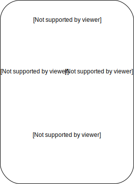

---
jupyter:
  celltoolbar: Slideshow
  jupytext:
    cell_metadata_filter: all
    formats: md
    notebook_metadata_filter: all,-language_info
    text_representation:
      extension: .md
      format_name: markdown
      format_version: '1.2'
      jupytext_version: 1.3.2
  kernelspec:
    display_name: Javascript (Node.js)
    language: javascript
    name: javascript
  notebookname: responsiveness
  rise:
    autolaunch: true
    slideNumber: c/t
    start_slideshow_at: selected
    theme: sky
    transition: cube
  toc:
    base_numbering: 1
    nav_menu: {}
    number_sections: true
    sideBar: false
    skip_h1_title: false
    title_cell: Table of Contents
    title_sidebar: Contents
    toc_cell: false
    toc_position:
      height: 47.7431px
      left: 91.9861px
      top: 25.9618px
      width: 159.497px
    toc_section_display: false
    toc_window_display: true
  version: '1.0'
---

<div class="licence">
<span>Licence CC BY-NC-ND</span>
<span>Thierry Parmentelat</span>
</div>

<!-- #region slideshow={"slide_type": ""} -->
# responsiveness
<!-- #endregion -->

```javascript
// run this cell, and then 
// click the created button
tools = require('../js/tools');
tools.init();
```

<!-- #region slideshow={"slide_type": "slide"} -->
## responsive, meaning ?
<!-- #endregion -->

* as opposed to a Word document - designed for a fixed page size
  * a web page gets displayed  
    on many different devices (computer, phone, tablet)
  * even on the computer, windows can be can  
    resized arbitrarily
* a responsive page adapts its layout to the device size
  * technically the visible area is called the **viewport**

<!-- #region slideshow={"slide_type": "slide"} -->
this means for example :
<!-- #endregion -->

<!-- #region cell_style="split" slideshow={"slide_type": ""} -->
wide viewport


<!-- #endregion -->

<!-- #region cell_style="split" -->
narrow viewport


<!-- #endregion -->

<!-- #region slideshow={"slide_type": "slide"} -->
## default layout policy
<!-- #endregion -->

* very well summarized in [this document on MDN](https://developer.mozilla.org/en-US/docs/Learn/CSS/CSS_layout/Normal_Flow)  
  (MDN stands for Mozilla Developer Network)
* mostly fits a written document flow  
  (think, a Word document)
* not at all suited for a responsive design

<!-- #region slideshow={"slide_type": "slide"} -->
## the `display` property - basic policies
<!-- #endregion -->

* layout policy is primarily materialized  
  in the `display` property
* values `inline`, `block` and `inline-block`  
  account for these "document-oriented" policies
  * have been supported from the very  
    beginning of the Web 
  * well illustrated [on this page on css-tricks.com](https://css-tricks.com/almanac/properties/d/display/)

<!-- #region slideshow={"slide_type": "slide"} -->
## `display` - more modern alternatives
<!-- #endregion -->

more modern values include :

* `grid` : like the name suggests, allows to define a rectangular area as an array of rows and columns
* `flex` : a more flexible layout, with more control on how children will fill the available space

we will study these 2 policies in separate notebooks

<!-- #region slideshow={"slide_type": "slide"} -->
## `display: none`
<!-- #endregion -->

* as an aside :
* one specific value for the `display` property is `none`
* in that case the element is present in the DOM
* but it does not show up at all in the rendered page

```javascript hide_input=true
display_none_html = `<p> an element can easily be 'hidden' from the output </p>

<p id="do-not-show"> let us hide this part altogether </p>

<p> in that case it won't show up at all, as if
it were not in the DOM at all - although it is present,
can be easily retrieved and turned back on,
using e.g. JavaScript</p>`;
display_none_css = `#do-not-show {
    display: none;
}`;
tools.iframe_html_css("display-none", display_none_html, display_none_css)
```
